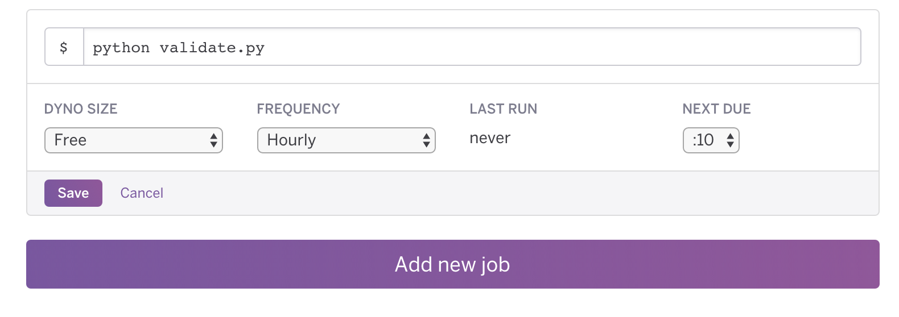
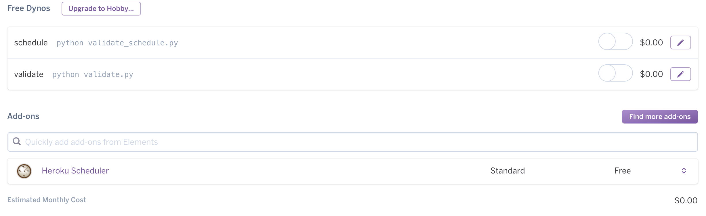

# AMP Validator Slack Service
[](https://jamesiv.es/adn/amp/2017/03/16/amp-validator-cat.html)
This is a Python webhook service which checks your top performing articles against the [Cloudflare AMP validator API](https://blog.cloudflare.com/amp-validator-api/).


## Requirements
This application requires [Python 2.7.13](https://www.python.org/) and the following packages which can be installed via pip.

```
requests==2.13.0
slackweb==1.0.5
APScheduler==3.0.0
```


## Configuration
The `settings.py` file contain two fields which are required by the application which can be customized.

```
SLACK_WEBHOOK_PATH: The webhook path found in your Slack API account.
ARTICLE_LIST_PATH: The API path for the API which contains the articles you want to check.

```

You'll also need to adjust the for loop array in the `getArticles()` function to to work with your own API. In addition you'll also need to change `amp_url` to match that of your own AMP article path.


## Running the Application
This application can be executed by running `$ python validate.py`. This will initialize the script and validate the articles you give it, once completed it will quit.

### Local Schedule
If you're deploying this application locally you can run `$ python schedule.py` which will use the APScheduler package to run the `validate.py` every hour.


## Deploying to Heroku
If you're deploying this application to Heroku you can deploy the build straight from the master branch for continuous deployment. If you'd like to utilize their free dynos you'll need to use [Heroku Scheduler](https://elements.heroku.com/addons/scheduler) add-on to schedule `python validate.py` to run every hour.



It's important that you don't allocate any additional dynos to this project otherwise the bot will start posting more than once an hour.




## Slack Messages
This service will alert the specified channel under the following conditions

* If any AMP document the tests have ran against contain an error that causes it to not validate.
* If there are four or more articles with AMP errors it will alert the developer team.
* If no errors are found it will post a confirmation error that the tests have been run.
* If the API service is not reachable it will alert the developer team.

  
