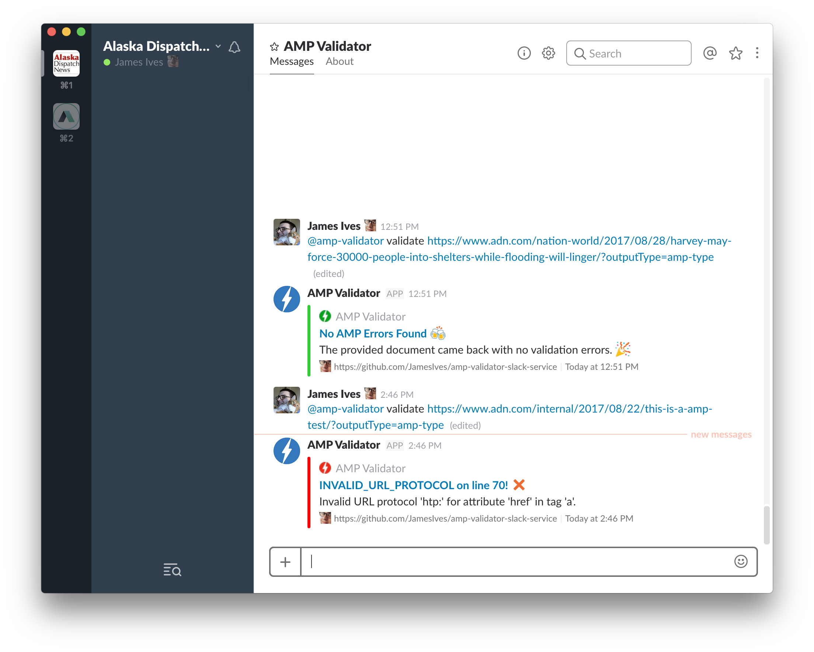

# AMP Validator Slack Bot
[](https://travis-ci.org/JamesIves/amp-validator-slack-bot) [](https://github.com/JamesIves/amp-validator-slack-bot/issues)

This is a Slack bot built with Python which validates [AMP documents](https://www.ampproject.org/) against the [Cloudflare AMP Validator API](https://blog.cloudflare.com/amp-validator-api/).


## Requirements
This application requires [Python 2.7.13](https://www.python.org/) and the following packages which can be installed via pip.

```
requests==2.20.0
slackclient==1.0.7
schedule==0.4.3
lxml==3.7.3
```


## Deploying the Bot
This bot can be deployed to any service such as [Heroku](https://www.heroku.com/).

For Heroku simply deploy the most recent version and assign a dyno to the worker specified in the Procfile, and then scale it.

```
$ heroku ps:scale --app amp-validator-slack-bot worker=1
```

For one-click install to Heroku you can use the button below. Please refer to the Configuration portion of the readme for further instructions. 

[](https://heroku.com/deploy?template=https://github.com/JamesIves/amp-validator-slack-bot/master)


## Chartbeat (Optional)
If you use Chartbeat you can validate pages that are returned from their API endpoints, this can be especially useful for publications which publish a high volume of content. In order for this to work you must provide a valid endpoint found within your [Chartbeat API settings](http://support.chartbeat.com/docs/api.html).

The bot is also capable of automatically validating against this endpoint at intervals. For instance you can give it an interval value of `60`, and a channel name of `#editors`, which would mean that every hour it would automatically validate the pages returned from Chartbeat, and if an error was found it would publish them to that channel.

For information on how to set these up please refer to the Configuration part of this readme. 


## Configuration
There are a number of environment variables needed in order to power this bot, some which are required, and some which are optional. If you're deploying the bot to Heroku you'll need to go to the `Settings` tab of the application and click `Reveal Config Vars` and replace or add the fields depending on your chosen method of installation.


| Key  | Value Information | Required |
| ------------- | ------------- | ------------- |
| `BOT_ID`  | The ID of your Slack bot user, this is required so the bot knows when a command is directed at it. If you're unsure what your bot ID is you can run `bot_id.py` which will print the ID, you'll need to make sure that the `BOT_NAME` field within the file corresponds with the one you setup in the Slack interface.  | **Yes** |
| `SLACK_BOT_TOKEN`  | The bot token found within the [Slack API settings](https://api.slack.com/bot-users).  | **Yes** |
| `CHARTBEAT_ENDPOINT`  | If you run Chartbeat analytics you can test your top performing pages against the Chartbeat API. This field requires an endpoint that you can find in your [Chartbeat API settings](http://support.chartbeat.com/docs/api.html), for more information see the Chartbeat part of this readme.   | **Optional**  |
| `CHARTBEAT_INTERVAL_TIME`  | If you'd like to periodically check the pages returned from the Chartbeat API without any user input you can enter an interval time for it to do so. This will silently check the pages and only alert if an error is found. Requires `CHARTBEAT_OUTPUT_CHANNEL` and `CHARTBEAT_ENDPOINT` to be entered for this to function. Requires a numeric value, for example `60` for 60 minutes. | **Optional** |
| `CHARTBEAT_OUTPUT_CHANNEL`  | If you'd like the interval check to work you need to enter a channel in order for errors to be logged to. Please see the [Slack API documentation on how to format this](https://api.slack.com/methods/chat.postMessage#channels). | **Optional** |


## Running the Application
This application can be executed locally by running `$ python app.py`. This will initialize the script and connect the bot.

There are a number of tests that can be run using `$ python tests.py` which test some of the utility functions of the bot.


## Commands
The following commands are accepted by the bot.

```
# Validates an AMP document, accepts either a regular page with a valid `amphtml` meta tag, or an amp document.
@bot validate <url>

# Validates all articles returned from the Chartbeat API. This only works if an endpoint enviroment variable is provided.
@bot chartbeat validate

# Returns the results of the last time the Chartbeat validator ran.
@bot chartbeat last

# Returns a list of all available commands
@bot help
```


## Feedback & Issues
Please post any feedback, requests or issues [here](https://github.com/JamesIves/amp-validator-slack-service/issues).



